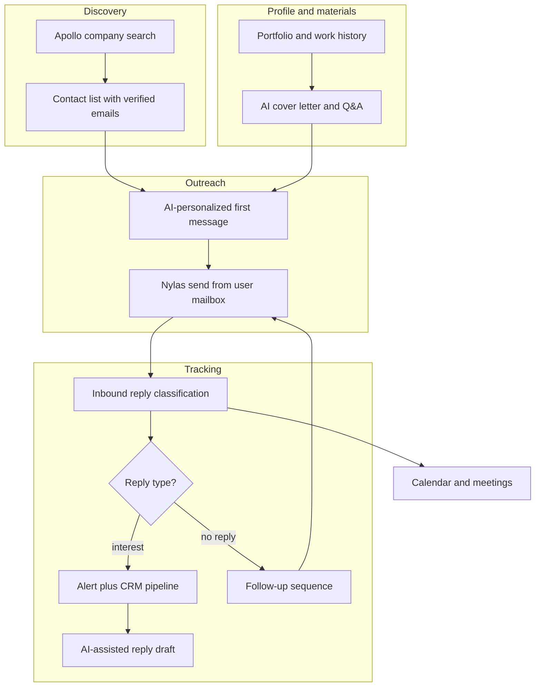

# Attio Leads Manager (MVP) — Project Overview

I built this outbound sales and lead-management platform to import prospects, research companies, run AI-personalized email campaigns from multiple mailboxes, track replies, classify responses, and move interested contacts into a CRM pipeline.

The same stack also supports **career search and proactive job outreach**: users store their background and portfolio, generate application materials with AI, discover target companies and contacts, send personalized first messages, track replies, and manage relationships through a pipeline — without relying only on job boards.

The system spans a **Node.js MVC API**, a **React admin app**, and **browser extensions** connected to the same backend (Gmail, Apollo, contact forms, and open tracking).

---

## Career search and application support

The platform is built around helping users take action on their job search, not just collect data.

| Capability | What it does |
|------------|--------------|
| **Personal profile and portfolio** | Users maintain portfolio profiles (work history, industries, skills, tags) and structured career content that AI uses as grounding for every generation call. |
| **Application materials** | AI generates tailored cover letters and answers to application or interview questions from a job description plus the user's stored background; cover letters export to PDF. |
| **Target company discovery** | Apollo search and saved filters help users find companies and contacts by industry, location, size, and keywords — building a list of where to reach out, not only where jobs are posted. |
| **Contact enrichment** | Leads import from Apollo, CSV/XLSX, and third-party contact APIs (e.g. ContactOut-style columns); email verification via Millions Verify before outreach. |
| **Proactive first contact** | AI composes personalized outreach messages per company and contact; users send from their own mailboxes through Nylas with rate limiting and daily quotas. |
| **Reply intelligence** | Inbound messages are classified (interest, rejection, out-of-office, no opening, etc.) so users see which conversations matter and which to ignore. |
| **Follow-up sequences** | Automated follow-ups for contacts with no reply after a configurable period; reply guard skips anyone who already responded. |
| **Relationship pipeline** | CRM tracks each contact from first outreach through discussion, call scheduled, proposal sent, and other statuses. |
| **Alerts and scheduling** | Slack notifications on high-intent replies; calendar sync for calls and follow-up tasks. |

In practice, users work through a loop that many career coaches recommend: **find the right companies and people, reach out directly, follow up, and nurture relationships** — with AI handling drafting, classification, and repetitive workflow steps.

---

## Architecture

### Backend (MVC)

| Layer | Location | Role |
|-------|----------|------|
| **Model** | `src/entities/` | TypeORM schemas (PostgreSQL): leads (`client`), mailboxes (`email`), templates, assignments, incoming messages, CRM clients, portfolios, etc. |
| **Controller** | `src/controllers/` | HTTP handlers: validate input, call services, return JSON |
| **View** | JSON responses | REST API only — no server-rendered HTML |
| **Services** | `src/services/` | Business logic: marketing send loop, inbox ingestion, AI compose, classification, calendar sync |
| **Routes** | `src/routes/` | Express route definitions |

Long-running automation (marketing sends, follow-ups, calendar sync) runs inside the Node process as background jobs. Inbound mail is ingested on a polling schedule, classified, and stored for review and follow-up decisions.

### Frontend

**email-leads-manager-app** — React 19 + TypeScript + Vite SPA. Pages cover Leads, Emails, Marketing, Incoming Messages, CRM Clients, Calendar, Templates, Companies, Portfolios, and Application (AI-assisted job materials).

### Browser extensions

| Extension | Purpose |
|-----------|---------|
| **gmail-extension** | Compose and send from Gmail using server templates / AI compose |
| **email-tracking-extension** | Follow-up tooling and tracking from Gmail |
| **apollo-search** | Pull company/contact data from Apollo into the lead pool |
| **contactform-fill** | Autofill contact forms from lead data |

---

## Tech Stack

| Area | Technology |
|------|------------|
| API runtime | Node.js 18+, Express (ES modules) |
| Database | PostgreSQL via TypeORM + migrations |
| Auth | JWT in HTTP-only cookies (optional middleware) |
| Email delivery & inbox | Nylas v3 (per-mailbox grant + API key) |
| AI | OpenAI — industry classification, template selection, application drafting, reply classification |
| Lead verification | Millions Verify API |
| Company data | Apollo API |
| Notifications | Slack webhook (high-intent replies) |
| Admin UI | React 19, Vite, Tailwind, Radix UI |
| File import | CSV / XLSX (multer + csv-parser / xlsx) |

---

## AI Features

### Portfolio-aware context selection

Before any AI generation call, the system selects the most relevant sections from a curated portfolio / experience knowledge base:

- Content is loaded from structured portfolio records and a consolidated markdown source.
- User input (job description, question, or chat history) is tokenized and matched against portfolio sections.
- Top-scoring sections are injected into the OpenAI prompt so outputs stay grounded in real experience rather than generic filler.

This is the same pattern used for a **private, user-specific knowledge base**: the more career material the user adds (projects, roles, skills), the more accurate and personal the AI output becomes across cover letters, Q&A, replies, and outreach.

### Cover letter generator

The Application module generates tailored cover letters from a job description and applicant profile:

- Input: company name, job description, full name, title, contact details, optional location and date.
- The service pulls relevant portfolio context for the role.
- OpenAI produces a first-person cover letter body in plain, natural English with strict prompt rules (no generic AI phrasing, no invented projects).
- The admin UI previews the result and exports a formatted PDF.

API: `POST /api/application/cover-letter`

### Application and interview Q&A

Users can ask role-specific application or interview questions and get concise answers grounded in their portfolio:

- Optional job description provides extra context.
- Responses are short, direct, and tied to documented experience where possible.

API: `POST /api/application/answer`

### AI message reply drafting

For ongoing email or chat threads, the system drafts the next reply:

- Uses full chat history plus optional job description context.
- Portfolio context is included only when it strengthens the reply.
- Output is a ready-to-send message body for human review before sending.

API: `POST /api/application/message-reply`

### AI outbound email compose (marketing)

For automated outreach campaigns, AI drives personalization at send time:

1. Fetch a summary from the lead's company website.
2. Classify industry via OpenAI (e.g. Fintech, E-commerce, AI).
3. Select the best subject and outreach template for that industry.
4. Render placeholders (`{{firstName}}`, `{{companyName}}`, `{{senderName}}`, optional `{{RANDOM|…}}` opener variants).
5. Send through Nylas from the assigned mailbox.

Controlled by `MARKETING_USE_AI_COMPOSE` (default `true`). Static template compose is available when AI compose is disabled.

### AI template batch generation

Subject and message templates can be generated in batches by industry through the template API, reducing manual copywriting for new verticals.

### Inbound message classification

Incoming replies are classified into actionable types:

- **Rule prefilter** — bounces, out-of-office, unsubscribe patterns, ignored sender domains (LinkedIn, Indeed, etc.).
- **OpenAI classification** — primary intent labeling.
- **Keyword rules fallback** — editable rules stored in `message_type_rules`.

Message types include: `interest`, `blocked`, `ooo`, `bad`, `no_job`, `other`. High-intent types (e.g. interest) trigger Slack notifications.

### AI-assisted manual replies

From the incoming-messages inbox, operators can draft in-thread replies with the same portfolio-aware message-reply service, then send via Nylas after review.

---

## Automation Workflows

### 1. Lead ingestion and preparation

```
Apollo / CSV upload / manual entry
        |
        v
   Leads table (client)
        |
        +-- Filter by status, location, industry, saved filters
        +-- Millions Verify (bulk) -> good / bad / risky
        +-- Uncontacted pool -> eligible for assignment
```

### 2. Outbound marketing campaign

```
Assign leads to mailboxes (daily quota)
        |
        v
For each pending lead:
   1. AI analyzes lead + company website
   2. Classify industry (OpenAI)
   3. Pick subject + message template
   4. Render placeholders
   5. Send via Nylas from assigned mailbox
   6. Mark lead sent; store subject, body, Nylas message ID
        |
        v
Random delay between sends (rate limiting / warmup)
```

**Assignment** — Operators bind uncontacted leads to mailboxes for a given date, respecting daily limits and mailbox eligibility.

**Orchestration** — "Start all" runs mailboxes in parallel (configurable concurrency) with per-mailbox delays and stuck-run recovery after server restarts.

### 3. Follow-up campaigns

Second pass for leads contacted 7+ days ago with no inbound reply:

```
Find prior outbound (marketing send) + Nylas thread ID
        |
        +-- Skip if inbound reply detected (reply guard)
        +-- Compose follow-up template -> send in-thread via Nylas
```

Follow-ups reuse template compose, resolve the original message ID for threading, and respect the same daily limits as marketing.

### 4. Inbound reply tracking

```
Nylas inbox poll (per mailbox)
        |
        v
Store in incoming_messages
        |
        v
Classify message type (rules + OpenAI + fallback)
        |
        +-- interest -> Slack alert
        +-- blocked / bad / ooo / no_job -> labeled, no alert
        +-- ignored domains -> skipped
```

**Reply guard** — When assigning follow-ups, stored inbound messages are checked so leads who already replied are skipped.

### 5. CRM and calendar

- Positive replies become **CRM clients** with pipeline statuses (first connected, in discussion, call scheduled, proposal sent, etc.).
- **Calendar sync** pulls Nylas calendar events; local recurring events support scheduling.
- Mailbox detail pages show sent leads and CRM clients tied to each sender address.

For job seekers, this pipeline is effectively a **personal CRM for career conversations**: who was contacted, who replied with interest, who is in discussion, and what meetings are coming up.

### 6. Templates and manual compose

- Subject and message templates live in one `template` table (types: `subject`, `outreach`, `followup`, `2nd-followup`).
- Manual **Send email** from a mailbox detail page uses the same Nylas send path with template pickers and recipient lookup against leads/CRM.

---

## Infrastructure (AWS)

Production layout:

```
                    +-----------------+
                    |  Route 53 / DNS |
                    +--------+--------+
                             |
              +--------------+--------------+
              v                             v
     +----------------+           +----------------+
     | CloudFront     |           | EC2 (API)      |
     | + S3           |           | Node.js server |
     | React static   |           | port 4000      |
     +----------------+           +--------+-------+
                                         |
                             +-----------+-----------+
                             v                       v
                    +----------------+      +----------------+
                    | RDS PostgreSQL |      | S3             |
                    | primary DB     |      | exports,       |
                    +----------------+      | uploads,backup |
                                            +----------------+

     +----------------+
     | Nylas          |---- send / inbox / calendar
     +----------------+
```

| Component | Role |
|-----------|------|
| **EC2** | Express API, background jobs, Nylas integration |
| **RDS (PostgreSQL)** | Leads, mailboxes, assignments, messages, CRM, templates, calendar |
| **S3 + CloudFront** | React static assets, exports, uploads |
| **External SaaS** | Nylas, OpenAI, Apollo, Millions Verify, Slack |

---

## End-to-end flow and Screenshots (summary)



## Repository map

| Repo | Role |
|------|------|
| `email-leads-manager-server` | MVC API, automation jobs, integrations |
| `email-leads-manager-app` | Admin dashboard |
| `gmail-extension` | Gmail-side sending |
| `email-tracking-extension` | Open/click tracking and follow-up from Gmail |
| `apollo-search` | Apollo -> leads |
| `contactform-fill` | Form autofill |

---

## Operational notes

- **Nylas credentials** are per mailbox (`grantId`, `nylasKey` in the database).
- **Rate limits**: marketing/follow-up use random inter-send delays; Nylas calls use backoff on 429 responses.
- **Migrations**: `npm run migration:run` on deploy.
- **Health check**: `GET /health` on port 4000 (default).
