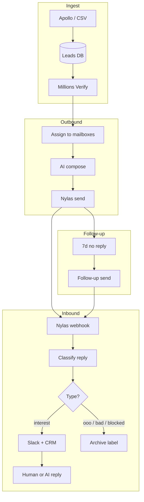

# Email Leads Manager — Project Overview

I built this outbound sales and lead-management platform to import prospects, research companies, run AI-personalized email campaigns from multiple mailboxes, track replies and mail events through **Nylas webhooks**, classify responses, and move interested contacts into a CRM pipeline.

The system spans a **Node.js MVC API**, a **React admin app**, and **browser extensions** that I connected to the same backend (Gmail, Apollo, contact forms, and open tracking).

---

## Architecture

### Backend (MVC)

I structured the server using classic **Model–View–Controller** layering:

| Layer | Location | Role |
|-------|----------|------|
| **Model** | `src/entities/` | TypeORM schemas (PostgreSQL tables): leads (`client`), mailboxes (`email`), templates, assignments, incoming messages, CRM clients, etc. |
| **Controller** | `src/controllers/` | HTTP handlers: validate input, call services, return JSON |
| **View** | JSON responses | REST API only — no server-rendered HTML |
| **Services** | `src/services/` | Business logic: marketing send loop, Nylas webhook handling, AI compose, classification, calendar sync |
| **Routes** | `src/routes/` | Express route definitions (including Nylas webhook endpoints) |

Long-running automation (marketing sends, follow-ups, calendar sync) runs **inside the Node process** as background jobs I implemented. **Inbound mail and tracking events are push-driven** via Nylas webhooks to the API—not polled on a fixed interval.

### Frontend

**email-leads-manager-app** — React + TypeScript + Vite SPA. Pages map to API modules (Leads, Emails, Marketing, Incoming Messages, CRM Clients, Calendar, Templates, Companies). Built static assets are served from the web tier in production.

### Browser extensions

| Extension | Purpose |
|-----------|---------|
| **gmail-extension** | Compose and send from Gmail using server templates / AI compose |
| **email-tracking-extension** | Track opens/clicks on outbound mail |
| **apollo-search** | Pull company/contact data from Apollo into the lead pool |
| **contactform-fill** | Autofill contact forms from lead data |

All extensions talk to the same REST API as the admin app.

---

## Tech Stack

| Area | Technology |
|------|------------|
| API runtime | Node.js 18+, Express (ES modules) |
| Database | **PostgreSQL** via TypeORM + migrations |
| Auth | JWT in HTTP-only cookies (optional middleware) |
| Email delivery & inbox | **Nylas v3** (per-mailbox grant + API key, **webhooks** for messages & events) |
| AI | **OpenAI** — industry classification, template selection, message/reply drafting |
| Lead verification | **Millions Verify** API |
| Company data | **Apollo** API |
| Notifications | **Slack** webhook (high-intent replies) |
| Admin UI | React 19, Vite, Tailwind, Radix UI |
| File import | CSV / XLSX (multer + csv-parser / xlsx) |

---

## Infrastructure (AWS)

Production layout I use:

```
                    ┌─────────────────┐
                    │  Route 53 / DNS │
                    └────────┬────────┘
                             │
              ┌──────────────┴──────────────┐
              ▼                             ▼
     ┌────────────────┐           ┌────────────────┐
     │ CloudFront     │           │ EC2 (API)      │
     │ + S3           │           │ Node.js server │
     │ React static   │           │ port 4000      │
     └────────────────┘           └───────▲────────┘
                                          │
                              ┌───────────┴───────────┐
                              ▼                       ▼
                     ┌────────────────┐      ┌────────────────┐
                     │ RDS PostgreSQL │      │ S3 (optional)  │
                     │ primary DB     │      │ exports,       │
                     └────────────────┘      │ uploads, backups│
                                             └────────────────┘

     ┌────────────────┐
     │ Nylas          │──── POST webhooks (messages, opens, calendar)
     └────────────────┘
```

| Component | Role |
|-----------|------|
| **EC2** | Runs the Express API and Nylas webhook handlers. Nylas pushes message and event notifications here in real time; background jobs handle marketing/follow-up sends and calendar sync. Environment variables hold API keys; Nylas grant credentials are per mailbox in RDS. |
| **RDS (PostgreSQL)** | Single source of truth: leads, mailboxes, campaign assignments, sent message metadata, incoming messages, CRM clients, templates, calendar events. |
| **S3** | Hosts the built React app (often behind CloudFront). Can also store CSV exports, upload archives, or DB backups. Upload endpoints currently write to temp disk; S3 is the natural target for durable file storage in production. |
| **CloudFront** | CDN for the admin UI and optional API caching at the edge. |

External SaaS (not on AWS): Nylas, OpenAI, Apollo, Millions Verify, Slack.

---

## Automation Workflows

### 1. Lead ingestion & preparation

```
Apollo / CSV upload / manual entry
        │
        ▼
   Leads table (client)
        │
        ├── Filter by status, location, industry, saved filters
        ├── Millions Verify (bulk) → good / bad / risky
        └── Uncontacted pool → eligible for assignment
```

- Leads are imported via **CSV/XLSX upload**, **Apollo extract**, or the UI.
- **Millions Verify** validates email deliverability before outreach.
- Saved **lead filters** and status fields control who enters the outbound pool.
- The **uncontacted** endpoint returns leads that are verified, `new`, and not already pending in a marketing assignment.

### 2. Outbound marketing campaign

This is the core automated outreach loop.

```
Assign leads to mailboxes (daily quota)
        │
        ▼
For each pending lead:
   1. AI analyzes lead + company website
   2. Classify industry (OpenAI)
   3. Pick subject + message template for that industry
   4. Render {{firstName}}, {{companyName}}, {{senderName}}, etc.
   5. Send via Nylas from assigned mailbox
   6. Mark lead sent; store subject, body, Nylas message ID
        │
        ▼
Random delay between sends (rate limiting / warmup)
```

**Assignment** — Operators (or “assign all”) bind uncontacted leads to mailboxes for a given date, respecting daily limits and mailbox eligibility (status, Nylas credentials, marketing enabled).

**Compose** — With `MARKETING_USE_AI_COMPOSE=true` (default), the pipeline:
1. Fetches a **website summary** from the lead’s company URL.
2. Asks OpenAI to **classify industry** (e.g. Fintech, E-commerce, AI-chatbot).
3. Selects the best **subject** and **outreach** template for that industry.
4. Fills placeholders and optional `{{RANDOM|…}}` opener variants.

**Send** — `marketingService` claims the mailbox assignment, sends through Nylas, updates `marketing_assignment_lead` status (`pending` → `sent` / `failed`), and marks the client row as sent.

**Orchestration** — “Start all” runs mailboxes in parallel (configurable concurrency) with per-mailbox delays and stuck-run recovery after server restarts.

### 3. Follow-up campaigns

A second pass for leads contacted **7+ days ago** with no inbound reply:

```
Find prior outbound (marketing send) + Nylas thread ID
        │
        ├── Skip if inbound reply detected (reply guard)
        └── Compose follow-up template → send in-thread via Nylas
```

Follow-ups reuse template compose (typically non-AI static templates), resolve the **original message ID** for threading, and respect the same daily limits and parallel-send controls as marketing.

### 4. Inbound reply tracking & classification

I use **Nylas webhooks** so the API is notified when mail arrives or message state changes—instead of polling every mailbox on a timer. Each configured grant has webhook subscriptions (e.g. `message.created`, `message.updated`, and related tracking events) pointing at my EC2 webhook URL.

```
Nylas event (new/updated message, open, etc.)
        │
        ▼
POST /api/nylas/webhook  →  verify signature, dedupe by message ID
        │
        ▼
Fetch full message if payload is lightweight
        │
        ▼
Store in incoming_messages
        │
        ▼
Classify message type:
   • Rule prefilter (bounces, OOO, unsubscribe, …)
   • OpenAI classification (primary)
   • Keyword rules fallback
        │
        ├── interest → Slack alert
   ├── blocked / bad / ooo / no_job → labeled, no alert
   └── ignored domains (LinkedIn, Indeed, …) → skipped
```

This push model gives **near-real-time** inbox updates, lower Nylas API usage than interval polling, and cleaner scaling as mailbox count grows.

**Message types** include: `interest`, `blocked`, `ooo`, `bad`, `no_job`, `other`. Rules are editable in the UI and stored in `message_type_rules`.

**Replies** — I review the inbox in the admin app. **Manual send** posts an in-thread reply via Nylas. **AI-assisted drafts** use OpenAI (`/api/application/message-reply`) with portfolio context. Incoming replies can be linked to **CRM clients** when saving contact details.

**Follow-up reply guard** — When assigning follow-ups, I check stored inbound messages (from webhook ingestion) to skip leads who already replied.

### 5. CRM & calendar

- Positive replies often become **CRM clients** with pipeline statuses (first connected, in discussion, call scheduled, proposal sent, etc.).
- **Calendar sync** pulls Nylas calendar events; local recurring events support scheduling follow-ups and meetings.
- Mailbox detail pages show **sent leads** and **CRM clients** tied to each sender address.

### 6. Templates & manual compose

- **Subject** and **message** templates live in one `template` table (types: `subject`, `outreach`, `followup`, `2nd-followup`).
- Templates can be **AI-generated** in batches by industry.
- Manual **Send email** from a mailbox detail page uses the same Nylas send path with template pickers and recipient lookup against leads/CRM.

---

## End-to-end flow (summary)



---

## Repository map

| Repo | Role |
|------|------|
| `email-leads-manager-server` | MVC API, automation jobs, integrations |
| `email-leads-manager-app` | Admin dashboard |
| `gmail-extension` | Gmail-side sending |
| `email-tracking-extension` | Open/click tracking |
| `apollo-search` | Apollo → leads |
| `contactform-fill` | Form autofill |

---

## How I develop with Claude, MCP & playbooks

*This section is about **my personal development practice**—not part of the Email Leads Manager product or its runtime stack. I include it here to show how I work with AI tooling to ship and maintain complex codebases consistently.*

### Overview

I use **Claude** (in Cursor or Claude Code) as my primary AI coding assistant. I connect it to repos and external tools through **MCP (Model Context Protocol) servers**, so it can read real code, run commands, and verify results—not rely on pasted snippets or guesswork.

Across every project I work on, I maintain **playbook** Markdown files: structured docs that capture conventions, domain rules, and client requirements. Before Claude generates or edits code, I point it at the relevant playbooks so output matches how the project is actually meant to be built.

### Playbooks

Playbooks live in a dedicated docs area (or a separate repo). They are **not** application config—they are living engineering specs for humans and AI.

| Playbook area | What I document |
|---------------|-----------------|
| **Conventions** | Repo layout, naming, layering (e.g. MVC), patterns for ORM/API/UI, testing and commit norms |
| **Domain & business logic** | Core workflows, state machines, edge cases, invariants that must not break |
| **Requirements** | What the client asked for, acceptance criteria, UX intent, known constraints |
| **Integrations** | Third-party APIs—auth, webhooks, rate limits, error handling |
| **Do / don’t** | Scope limits (small diffs), security rules, what to never auto-refactor |

If a playbook and the code diverge, I fix one or the other immediately. Stale playbooks are the main reason AI-assisted code quality drops over time.

### Typical task flow

```
1. I describe the task in Claude (repo open, MCP enabled)
        │
        ▼
2. Claude reads the relevant playbook sections first
        │
        ▼
3. Claude explores the codebase via MCP
   (search, read files, run grep, shell, browser when needed)
        │
        ▼
4. Changes follow playbook rules and existing patterns in that repo
        │
        ▼
5. I verify in the same session—lint, build, tests, manual check via MCP
        │
        ▼
6. If behavior or rules changed → I update the playbook for the next session
```

### Why I use MCP

| Without MCP | With MCP |
|-------------|----------|
| Limited to files pasted into chat | Full repo search and read |
| Cannot confirm builds or tests | Run shell commands and read output |
| May invent APIs or paths | Inspect real definitions and usages |
| Manual copy-paste for UI checks | Browser MCP for end-to-end verification when set up |

Common MCP servers I wire up: filesystem, git, terminal/shell, GitHub, browser, and project-specific tools (docs, DB, etc.).

### Practices I follow

| Practice | Why |
|----------|-----|
| **Playbooks before codegen** | Context loads rules before any diff is written |
| **One focused task per session** | Reduces scope creep and conflicting instructions |
| **“Match existing code” over reinventing** | New code should look like the rest of the repo |
| **Update playbooks after merges** | New env vars, statuses, or flows get documented right away |
| **Verify in-session** | Same conversation that wrote the code runs build/lint/test |

This workflow is **project-agnostic**. I apply it to client work, side projects, and monorepos like the one described above—the product itself does not depend on Claude at runtime; Claude is how I build and maintain it.

---

## Operational notes

- **Nylas credentials** are per mailbox (`grantId`, `nylasKey` in the database), not global env vars.
- **Nylas webhooks**: subscriptions are registered per grant; handlers verify Nylas signatures and dedupe by `messageId` before classify/store.
- **Rate limits**: marketing/follow-up use random inter-send delays; outbound Nylas calls use backoff on 429 responses.
- **Migrations**: run `npm run migration:run` on deploy; dev may use TypeORM `synchronize` when `NODE_ENV=development`.
- **Health check**: `GET /health` on the API port (default 4000).

For API details and environment variables, see [README.md](../README.md).
