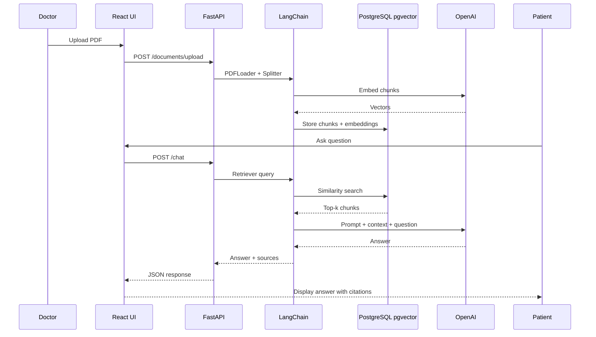

# Twiper — Healthcare AI Chatbot (RAG) — Technical Overview

**Live product:** [https://twiper.me](https://twiper.me)  
**Application:** [https://app.twiper.me](https://app.twiper.me)

This document describes an independently built LLM application I developed for **Twiper**, an Italian healthcare and wellness platform. Twiper helps users describe health and wellness needs in chat, get AI-guided support, and connect with qualified professionals for video consultations.

My contribution focused on the **RAG-based healthcare chatbot backend and integration**: doctors upload medical PDF documents, the system indexes them in a vector database, and patients receive answers grounded in those documents rather than relying only on the model's pre-trained knowledge.

---

## 1. Product context

Twiper operates in the health, wellness, psychology, and aesthetics space. From the public product:

- Users start a chat and describe a health or wellness problem.
- The platform uses AI to understand the request and guide the user toward the right professional.
- Users can book a private video consultation ("Twip") with a matched provider.
- Privacy is emphasized: consultation content stays between user and professional.

The RAG chatbot I built supports the **knowledge layer** behind that experience: curated medical and professional content uploaded as PDFs becomes searchable context for patient-facing Q&A, improving answer accuracy and traceability in a regulated domain.

---

## 2. Problem and approach

### Problem

General-purpose LLMs can answer health-related questions fluently but may:

- Hallucinate facts not present in the organization's approved materials
- Lack access to doctor-specific or clinic-specific documentation
- Provide answers without a clear link to source documents

### Approach: Retrieval-Augmented Generation (RAG)

I used **LangChain** to orchestrate a RAG pipeline:

1. **Ingest** — Doctors upload PDFs through the frontend.
2. **Index** — Text is extracted, chunked, embedded, and stored in **PostgreSQL with pgvector**.
3. **Retrieve** — On each patient question, similarity search returns the most relevant chunks.
4. **Generate** — Retrieved chunks are injected into a prompt; **GPT** produces an answer grounded in those sources.
5. **Return** — The frontend displays the answer with **source references** so users can see which document sections supported the response.

This keeps generation tied to uploaded medical documents instead of open-ended model knowledge alone.

---

## 3. System architecture

```
                         +---------------------------+
                         |   React + TypeScript UI   |
                         |   (chat + PDF upload)     |
                         +-------------+-------------+
                                       |
                                       | HTTPS / REST
                                       v
                         +---------------------------+
                         |   FastAPI backend         |
                         |   - upload API            |
                         |   - chat / query API      |
                         |   - session management    |
                         +------+--------+-----------+
                                |        |
                    +-----------+        +------------------+
                    v                                     v
           +----------------+                    +------------------+
           | PostgreSQL     |                    | OpenAI API       |
           | + pgvector     |                    | - embeddings     |
           | (chunks +      |                    | - chat completion|
           |  embeddings)   |                    +------------------+
           +----------------+
                    ^
                    |
           +--------+--------+
           | LangChain       |
           | orchestration   |
           | - loaders       |
           | - splitters     |
           | - retriever     |
           | - prompts       |
           | - memory        |
           +-----------------+
```

| Layer | Technology | Role |
|-------|------------|------|
| Frontend | React, TypeScript | Chat UI, PDF upload, answer display with source citations |
| API | FastAPI (Python) | File upload, query handling, session and document metadata |
| Orchestration | LangChain | Document loading, chunking, embedding, retrieval, prompt assembly, conversation memory |
| Embeddings + LLM | OpenAI | `text-embedding-*` for vectors, GPT for final answers |
| Vector store | PostgreSQL + pgvector | Persistent storage and similarity search over document chunks |
| Documents | PDF (doctor uploads) | Source of truth for RAG context |

---

## 4. RAG ingestion pipeline (PDF upload)

End-to-end flow when a doctor uploads a document:

```
Upload PDF (React frontend)
        |
        v
FastAPI receives file (multipart upload)
        |
        v
LangChain PDFLoader extracts raw text
        |
        v
RecursiveCharacterTextSplitter creates chunks
        |
        v
OpenAIEmbeddings generates vector per chunk
        |
        v
Chunks + embeddings stored in pgvector (PostgreSQL)
        |
        v
Document metadata saved (filename, doctor/clinic, upload time, chunk count)
```

### LangChain components (ingestion)

| Step | LangChain component | Purpose |
|------|---------------------|---------|
| Load | `PDFLoader` (or equivalent document loader) | Extract text from uploaded PDF |
| Split | `RecursiveCharacterTextSplitter` | Break long documents into retrieval-sized chunks with overlap |
| Embed | `OpenAIEmbeddings` | Convert each chunk to a dense vector |
| Store | Vector store adapter backed by **pgvector** | Persist chunks and embeddings for similarity search |

### Chunking strategy

- **RecursiveCharacterTextSplitter** splits on natural boundaries (paragraphs, sentences) to avoid cutting mid-thought.
- Chunk size and overlap are tuned so each segment is small enough for precise retrieval but large enough to preserve medical context.
- Metadata (document ID, page number, source filename) is attached to each chunk for citation in the UI.

---

## 5. RAG query pipeline (patient question)

When a patient submits a question in chat:

```
User question (React frontend)
        |
        v
FastAPI chat endpoint
        |
        v
LangChain Retriever — similarity search on pgvector
        |
        v
Top-k relevant chunks selected
        |
        v
PromptTemplate — inject chunks + question + system instructions
        |
        v
GPT (chat completion)
        |
        v
Answer + source references returned to frontend
```

### LangChain components (query)

| Step | LangChain component | Purpose |
|------|---------------------|---------|
| Retrieve | `VectorStoreRetriever` (pgvector-backed) | Similarity search for question-relevant chunks |
| Prompt | `PromptTemplate` / chat prompt chain | Combine system rules, context chunks, and user question |
| Generate | OpenAI chat model via LangChain | Produce grounded natural-language answer |
| Memory | Conversation memory (buffer or summary) | Maintain multi-turn context within a session |

### Source references

Each answer includes references to the document chunks used (e.g. document name, page or chunk index). This supports:

- User trust and transparency
- Doctor review of what content informed the answer
- Debugging when retrieval quality needs improvement

---

## 6. LangChain responsibilities (summary)

LangChain was used as the orchestration layer for:

| Capability | Implementation |
|------------|----------------|
| Document loading | PDF text extraction via LangChain loaders |
| Text splitting | `RecursiveCharacterTextSplitter` |
| Embedding generation | `OpenAIEmbeddings` |
| Vector storage and search | pgvector integration through LangChain vector store |
| Retrieval | Retriever with top-k similarity search |
| Prompt orchestration | `PromptTemplate` with injected context blocks |
| Conversation memory | Session-scoped memory for follow-up questions in the same chat |

This avoided wiring each step manually and kept the pipeline modular (e.g. swap embedding model or splitter without rewriting the API).

---

## 7. API design (FastAPI)

Representative endpoints:

| Method | Endpoint | Description |
|--------|----------|-------------|
| `POST` | `/api/documents/upload` | Upload PDF; trigger ingest + embed pipeline |
| `GET` | `/api/documents` | List uploaded documents for a doctor/clinic |
| `POST` | `/api/chat` | Submit question; run RAG retrieval + LLM; return answer + sources |
| `GET` | `/api/chat/history` | Retrieve conversation history for a session |

Request/response shape (chat):

```json
// POST /api/chat
{
  "sessionId": "uuid",
  "question": "What are the recommended exercises for lower back pain?"
}

// Response
{
  "answer": "...",
  "sources": [
    { "documentId": "...", "filename": "physio-guidelines.pdf", "page": 4, "excerpt": "..." }
  ]
}
```

---

## 8. Data model (PostgreSQL + pgvector)

| Table / entity | Purpose |
|----------------|---------|
| `documents` | Uploaded PDF metadata (id, filename, uploader, status, created_at) |
| `document_chunks` | Text segments with `embedding vector`, foreign key to document, chunk index, optional page |
| `chat_sessions` | Session id, user reference, timestamps |
| `chat_messages` | Role (user/assistant), content, linked session, optional source chunk ids |

**pgvector** enables cosine (or L2) similarity search directly in PostgreSQL, avoiding a separate vector DB for this scale while keeping transactional consistency with document and chat metadata.

Example similarity query pattern:

```sql
SELECT chunk_text, document_id, page
FROM document_chunks
ORDER BY embedding <=> :query_embedding
LIMIT 5;
```

---

## 9. Frontend (React + TypeScript)

The chat UI provides:

- **PDF upload** for doctors (drag-and-drop or file picker, upload progress, success/error states)
- **Chat interface** for patients (message list, input, streaming or loading state)
- **Source citations** under each assistant message (expandable excerpts from retrieved chunks)
- Responsive layout for mobile and desktop (aligned with Twiper's public positioning)

The frontend calls FastAPI REST endpoints only; no direct OpenAI or database access from the browser.

---

## 10. Safety and reliability considerations

Healthcare contexts require extra care. Measures implemented or structured in the pipeline:

| Concern | Mitigation |
|---------|------------|
| Hallucination | Answers must use retrieved context; system prompt instructs model to say when context is insufficient |
| Wrong medical advice | Disclaimers in UI; answers framed as information from uploaded documents, not diagnosis |
| Stale or wrong documents | Document versioning and re-index on replace |
| Empty retrieval | Fallback response when no relevant chunks meet similarity threshold |
| Prompt injection | Sanitize user input; strict system prompt boundaries |
| Privacy | Documents and chats scoped per clinic/doctor; no cross-tenant retrieval |

Prompt engineering included instructions to use simple language, cite only from provided context, and avoid definitive diagnostic language.

---

## 11. Infrastructure and deployment

Production-oriented layout:

```
                    +------------------+
                    |  CDN / static    |
                    |  React build     |
                    +--------+---------+
                             |
              +--------------+--------------+
              v                             v
     +----------------+           +----------------+
     | FastAPI        |           | PostgreSQL     |
     | (uvicorn)      |<--------->| + pgvector     |
     | EC2 / container|           | (RDS)          |
     +--------+-------+           +----------------+
              |
              v
     +----------------+
     | OpenAI API     |
     | (embeddings +  |
     |  completions)  |
     +----------------+
```

| Component | Role |
|-----------|------|
| **React static hosting** | Serves the chat and upload UI |
| **FastAPI service** | Handles uploads, RAG pipeline, chat API |
| **PostgreSQL + pgvector** | Document metadata, chunks, embeddings, chat history |
| **OpenAI** | Embeddings at index time; GPT at query time |
| **Object storage (optional)** | Original PDF files alongside DB index |

Environment configuration (representative):

- `OPENAI_API_KEY` — embeddings and chat
- `DATABASE_URL` — PostgreSQL with pgvector extension enabled
- `CHUNK_SIZE`, `CHUNK_OVERLAP`, `TOP_K` — retrieval tuning
- `EMBEDDING_MODEL`, `CHAT_MODEL` — model selection

---

## 12. End-to-end sequence (combined)



---

## 13. Screenshots and demo

<!-- Screenshot: Twiper landing page — healthcare chat entry point -->
*[Screenshot: Twiper homepage / chat entry]*

<!-- Screenshot: Doctor PDF upload UI -->
*[Screenshot: PDF upload screen]*

<!-- Screenshot: Patient chat with AI answer -->
*[Screenshot: Chat interface with user question and assistant reply]*

<!-- Screenshot: Source references / citations under answer -->
*[Screenshot: Answer with document source references]*

<!-- Screenshot: Document list or admin view (optional) -->
*[Screenshot: Uploaded documents list]*

---

## 14. Tech stack summary

| Area | Stack |
|------|-------|
| Frontend | React, TypeScript |
| Backend | FastAPI (Python) |
| AI orchestration | LangChain |
| LLM + embeddings | OpenAI (GPT + embedding models) |
| Database | PostgreSQL with pgvector |
| Document format | PDF (doctor uploads) |

---

## 15. Outcomes

- Delivered a **production RAG chatbot** where patient answers are grounded in doctor-uploaded medical PDFs.
- Used **LangChain** end-to-end: load, split, embed, store, retrieve, prompt, and memory.
- Combined **pgvector** with PostgreSQL for a single-database architecture (metadata + vectors + chat history).
- Built **source-attributed responses** so users and professionals can see which documents informed each answer.
- Integrated the pipeline into Twiper's broader healthcare product (chat-led wellness guidance and professional matching).

---

## Links

- Product: [https://twiper.me](https://twiper.me)
- App login: [https://app.twiper.me](https://app.twiper.me)
- Company: Twiper srl, Torino, Italy
